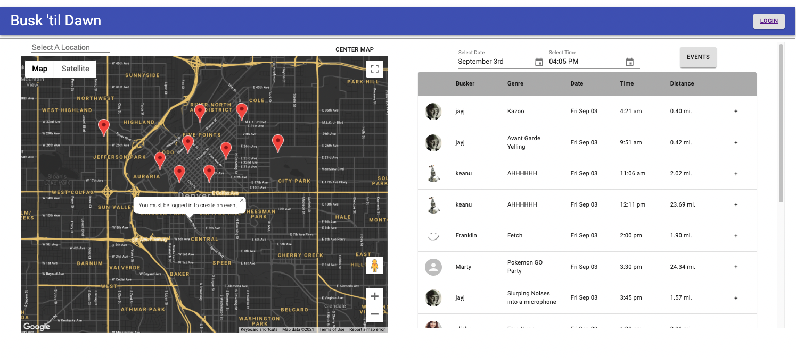
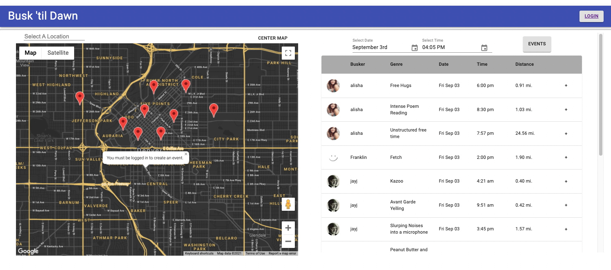
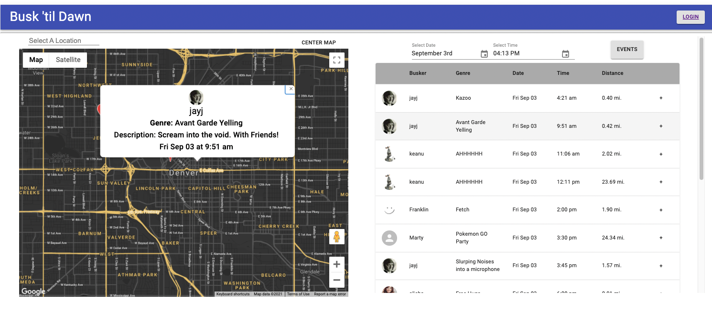
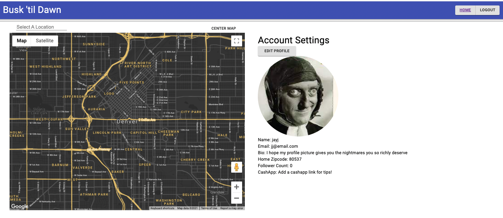
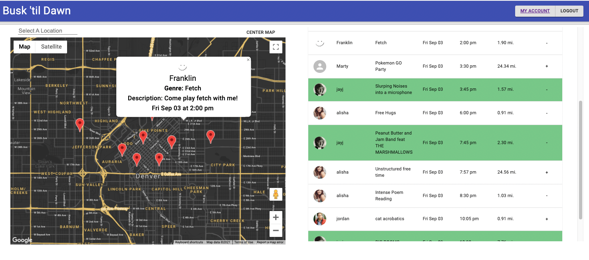
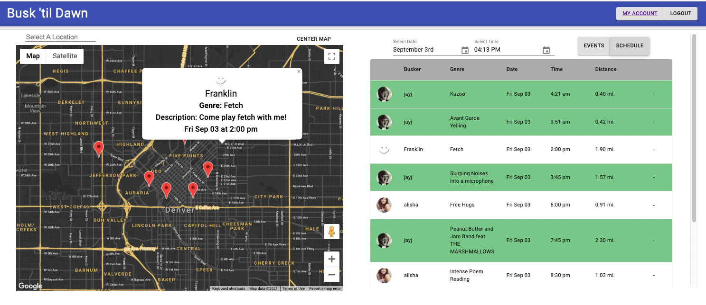
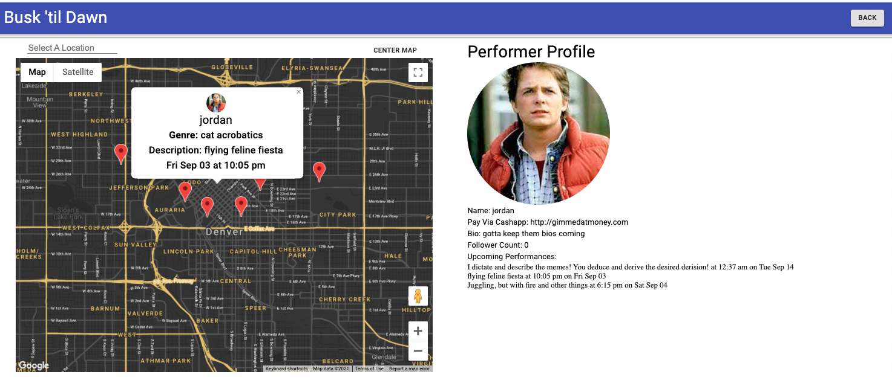

# From Busk 'til Dawn

                 

## About

Final project for Hackreactor 2021. The Project involved working with a client to develop a full-stack app from the ground up. Busk 'til Dawn is a geolocation application to schedule, plan, and track street performance events. Using Google maps users can view any nearby event pins based on either the users current position or an input location.

Users can schedule their own events by dropping a pin on the map. Users can also track their attending and hosted event schedule and view other user profiles.

User login facilitated through PassportAuth, user data and calendar stores using MongoDB and Mongo Atlas, and geolocation service implemented through MongoDB Geospatial Queries.

## Requirements

[Node.js](https://nodejs.org) necessary for running scripts and installing dependencies via 'npm'.

## Installation/Setup

1. Clone this repository
2. Using the terminal navigate inside the repository
3. run `npm install` to install the required dependencies
4. run `npm run bundle-dev` or `npm run bundle-prod` to build the project with either development or production settings and serve the resulting build on `localhost:3005`

## Usage
Here is the public version of [Busk 'til Dawn](https://gentle-ocean-96036.herokuapp.com/)

## Roadmap
On page load, you will see the interactive map set to the default location for your area. In the case, Denver. You will also see the calendar of events within 30miles that will take place over the next 24hrs. If you attempt to add an event when not logged in, you will receive a notification instructing you to login in order to add events.

Curious about a specific performers performances? Click any of the heading and the calendar view will sort accordingly by performer name, time, performance genre, or distance.

Curious about events but don't want to login? No worries! You can still click an event to see the details pop up in the map view.

At this you want to attend the event and realize you may forget. Time to login! Create an account with validation for email, password length, password complexity, and password consistency

Already have an account? Login to view your existing schedule

Once logged in, click the Account Setting button in the upper right to see your profile, add a cashapp link, or change your default zipcode.

Once logged in, events you are hosting will appear in green and events you are attending will apear with minus signs. Want to add an event to your calendar? Click the plus sign and it will become a minus and add the event and the details of that event will pop up on the map.

Only want to see the events you're attending or hosting? Click the schedule tab and all other events will disappear.

Want to perform? Click a location on the map and you'll be prompted to add details for your event. Once it's added, the calendar will display it in real time once you're in the right location/timeframe.

Find a performer you're excited about? Click their name and you'll see their public profile including a CashApp link for tips! Their profile also includes a list of their upcoming performances.

## Authors

#### Keanu Hasty

#### JJ Marquis

#### Jordan Trimarchi

#### Alisha Edington

